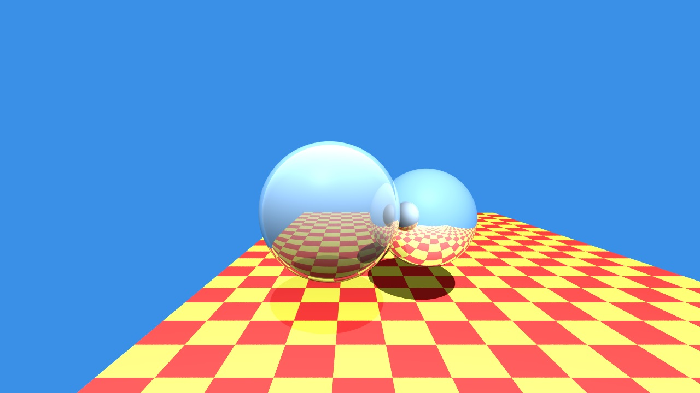
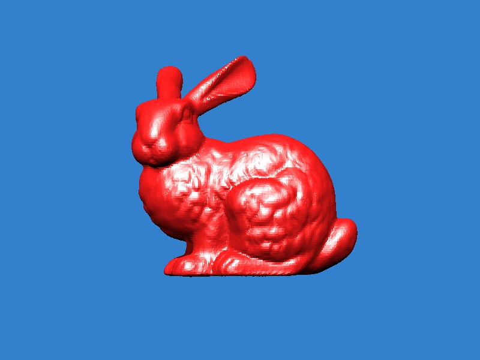
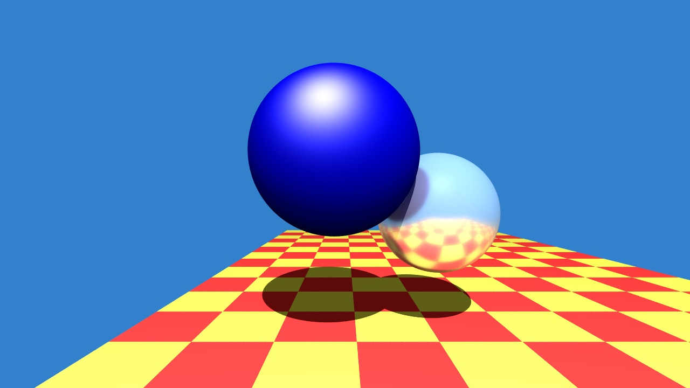
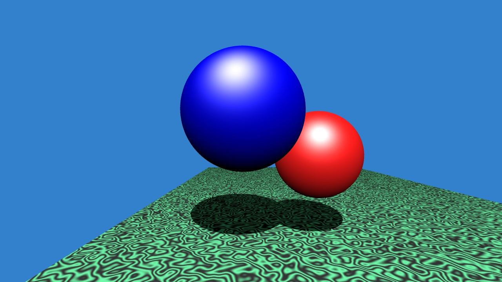

# Ray Tracer

C++ implementation of a ray tracer for CSCI-711 Global Illumination.

By: Nalin Ranjan

## Build Instructions

Requires the PNGWriter, PNG and libz C++ libraries for generating output.

Requires the Eigen C++ library for matrix operations.

Replace the Eigen path specified in the Makefile with your Eigen path and run:

```
make
```

Run the ray tracer with:

```
./main
```

## Renders









